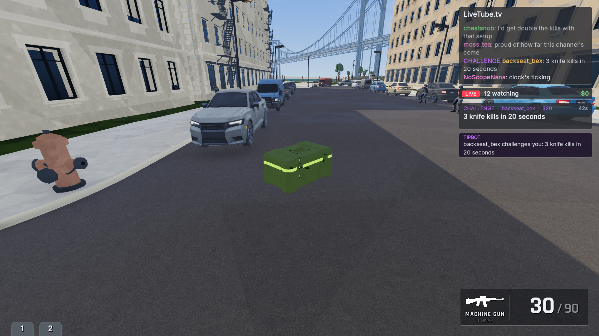
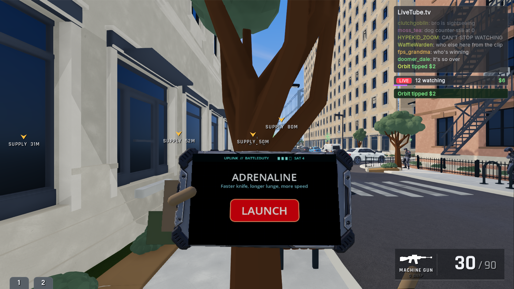
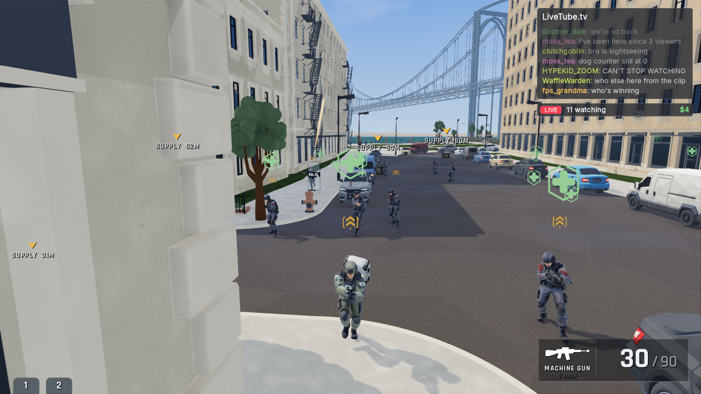
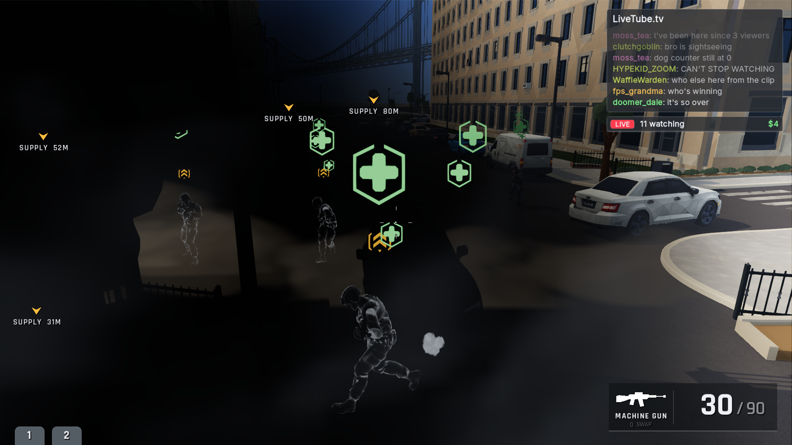

# Approved placeholder integration ? #939

Game commit `b9c41209330bed6a84c978b42e71e109c6c09b91` on `feat/placeholder-replacements-939`, rebased onto
`e0f748c3f` (separate weapon magazines). Kamran approved the four concepts
("The concepts looks fine") and the exact models and prepared icons ("Yes to all")
on 2026-10-04. `approvals.json` pins the approved raw hashes and review images.

- Ammo crate replaces `AmmoBoxPlaceholder`: 500,000 ? 16,167 triangles via the
  approved limited-dissolve/distance-outline tool, welded seams, fixed flat
  olive/lime/graphite materials, no textures, uniform 0.5 m width. Ten boundary
  edges below 2 mm remain after near-zero filtering, recorded in provenance.
- Tablet replaces the slab, keeps PBR and detailed housing, and has a solid
  graphite rear instead of a duplicated screen. The existing live UI and hands
  remain. The cleaned model is 396,873 triangles with three embedded images.
- Medic signs/badges and officer prisms use the approved white alpha icon masks,
  tinted mint/amber in-engine. Existing timing, pooling and depth occlusion stay.
  Losing medic support drops a white fading heal icon.

Captures are native 1920?1080 pixels from an owned, windowed off-screen GodotJS
4.6.1 run (`placeholder-939-final-captures`), through godot-cli. The isolated
survival run uses invincibility/bench, explicit enemy placement and free-camera
framing so the assets can be examined. The tablet is a real Adrenaline call-in.
No image composites or desktop captures are used. The officer close view also
shows the marker against active combat smoke; the medic view shows both icons
in clear daylight.

Validation: pnpm format, build and lint (existing max-lines warnings); resource
import; headless smoke with runtime pickup/enemy setup; off-screen runtime
captures; lighting capture check; raw/derived hashes and texture counts;
identical accelerated triangulation for 48 concave polygons and a bridged hole.
Headless inspection emits native shader/zero-depth projection warnings; no
TypeScript or resource-load failures were found.

Prepared sources, unchanged raw output, exact planar-tool snapshot, intermediate
geometry and provenance: [art-source archive](https://github.com/KamranAsif/Godmode.exe-art-source/tree/17ec8c5/derived/placeholder-replacements-939).

